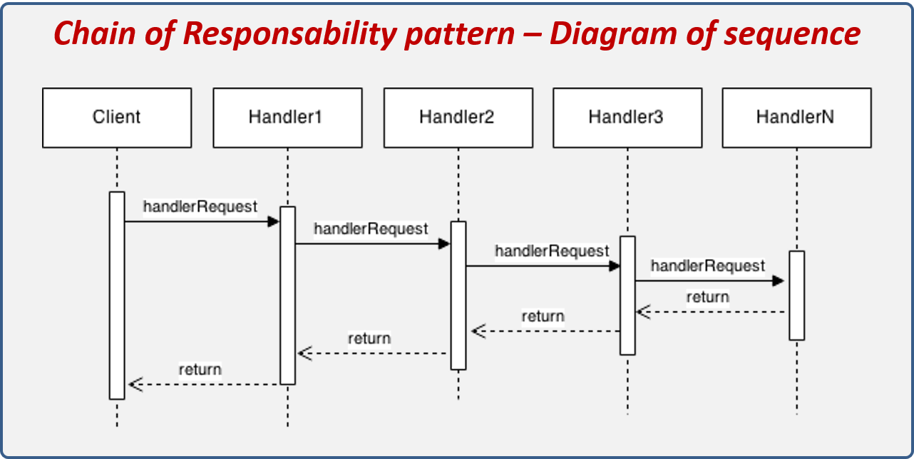
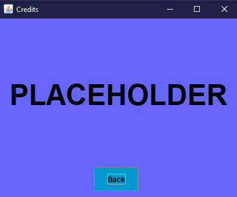

Proiect

Ingineria Programelor

Bubble Sorting

Coordonator, Student,

Cristian Sandu Chitiga Alexandru Gabriel

ANUL III CTI

GRUPA 22C32 A

AN 2022-2023

**Cuprins**

[1.Analiza Jocului](#analiza-jocului)

[2.Ierarhia pachetelor](#2ierarhia-pachetelor)

[3.Prezentarea Sabloanelor](#prezentarea-sabloanelor)

[3.1.Singleton](#31singleton)

[3.2.Mediator](#32mediator)

[3.3.Command](#33-command)

[3.4.Adapter](#34-adapter)

[3.5.Chain of Responsibility](#35-chain-of-responsibility)

[4.Plan de testare](#4-plan-de-testare)

[5.Prezentare Joc](#5-prezentare-joc)

**  
**

**Introducere**

Proiectarea orientată pe obiecte a software-ului presupune identificarea de obiecte, abstractizarea lor în clase de granularitate potrivită, definirea interfeţelor şi ierarhiilor de moştenire, stabilirea relaţiilor între aceste clase.

Soluţia trebuie să rezolve problema şi să fie în acelaşi timp suficient de flexibilă pentru a rezista la noi cerinţe şi probleme ce pot apare în timp.

Proiectanţii cu experienţă refolosesc soluţiile bune de câte ori au ocazia. Există grupări de clase sau obiecte care se repetă în cele mai diferite sisteme. Acestea rezolvă probleme specifice, folosirea lor fac proiectele mai flexibile, mai elegante, reutilizabile. Un proiectant care stăpâneşte un set de asemenea şabloane le poate aplica imediat la noile proiecte fără a mai fi nevoit să le redescopere.

Şabloanele ce se pot refolosi pot fi general valabile sau specifice unui domeniu, de exemplu pentru probleme de concurenţă, sisteme distribuite, programare în timp real, etc.

**Etapele Proiectului:**

**-**Analiza

\-Design

\-Implementare

\-Testare

# Analiza Jocului

**Aplicație –** Bubble Sorting **–** **https://poki.ro/g/bubble-sorting**

Scopul jocului este de a sorta un numar de bile de diferite culori in multiple tuburi. Modalitatea de a castiga in acest joc este de a sorta in toatalitate bilele in acest proces lasand unul sau mai multe tuburi goale.

Regulile Jocului:

\-Poti muta o singura bila dintr-un tub in altul conditia fiind ca al doilea tub selectat sa fie ori liber, ori aceeasi culoare ca si bila selectata.

\-Este posibil ca jocul sa nu poata fi incheiabil daca nu exista miscari valide mentionate mai sus.

\-Jocul se incheie automat cand toate bilele sunt sortate.

Aplicația “**Bubble Sorting**” este scrisă în limbajul Java.  
Mediu folosit: Apache NetBeans IDE 12.6.

Librari folosite:

# 2.Ierarhia pachetelor

****

# Prezentarea Sabloanelor

In proiect s-au utilizat urmatoarele sabloane:

## 3.1.Singleton

Singleton este un șablon de proiectare creațional care permite să se asigure că o clasa are o singură instanță, oferind în același timp un punct de acces global la această instanță.

Toate implementările Singleton au acești doi pași în comun:

⦁ Faceți constructorul implicit privat, pentru a împiedica alte obiecte să folosească operatorul new cu clasa Singleton.

⦁ Creați o metodă statică care să acționeze ca un constructor. În interior această metodă apelează construcorul privat pentru a crea un obiect și a-l salva ca un câmp static.

Singleton trebuie folosit când o clasă din program ar trebui să aibă doar o singură instanță disponibilă pentru toți clienții.

Singleton folosit in clasa main:

Singleton folosit pentru crearea nivelelor:

## 3.2.Mediator

Mediator este un șablon de design comportamental care permite să reducem dependențele haotice dintre obiecte. Modelul restricționează comunicațiile directe între obiecte și le obligă să colaboreze numai prin intermediul unui obiect mediator.

Folosiţi Mediator când:

-   mulţime de obiecte comunică într-un mod bine definit dar complex;
-   Interdependenţele sunt nestructurate şi dificil de înţeles;
-   Refolosirea unui obiect este dificilă deoarece comunică cu prea multe alte obiecte
-   Un comportament distribuit între mai multe clase ar trebui să fie readaptabil fără derivare

****

Sablonul Mediator este regasit in clasa Level Selector care este folosit pentru ce ii spune si numele. Aceasta clasa este folosita la comutarea dintre nivele si meniul principal.

## 3.3. Command

În programarea orientată pe obiecte, șablonul de comandă este un model de proiectare comportamentală în care un obiect este utilizat pentru a încapsula toate informațiile necesare pentru a efectua o acțiune sau pentru a declanșa un eveniment la un moment ulterior. Aceste informații includ numele metodei, obiectul care deține metoda și valorile pentru parametrii metodei.

Încapsulează cereri ca obiecte, şi permite:

-   parametrizarea clienţilor cu diferite cereri
-   înlănţuirea sau log-area cererilor
-   suport pentru operaţii anulabile (UNDO)

In cazul acestui proiect avem:

## 3.4. Adapter

Adaptorul este un sablon de design structural care permite obiectelor cu interfețe incompatibile să colaboreze.

Scop:

-   Converteşte interfaţa unei clase într-o altă interfaţă aşteptată de client
-   Permite unor clase cu interfeţe diferite să lucreze împreună (prin “traducerea” interfeţelor)

    

    Pentru sablonul Adapter, am folosit libraria Java Jaco Mp3 Player deoarece acesta include clasele specifice sablonului respective si totodata permita utilizarea fisierelor de tip mp3 ceea ce face implementarea muzicii in aplicatie, simpla.

    

## 3.5. Chain of Responsibility

Chain of Responsibility este un șablon de design comportamental care vă permite să transmiteți cereri de-a lungul unui lanț de gestionari. La primirea unei cereri, fiecare handler decide fie să proceseze cererea, fie să o transmită următorului handler din lanț.

Aplicabilitate:

-   mai mult decât un obiect poate trata o cerere şi nu cunoaştem apriori cine o va trata
-   mulţimea de obiecte ce pot trata cererea trebuie să fie specificabilă dinamic
-   trimitem o cerere la mai multe obiecte fără să specificăm primitorul

In cazul acestui proiect avem:

# 4. Plan de testare

Testare:

-   Functionarea butoanelor
-   Construirea nivelului
-   Functionalitatea timer-ului din cadrul nivelelor

**Junit Tests:**

JUnit este o librarie utila oricarui programator Java, permitând cresterea vitezei de programare si depistarea erorilor sau a bug-urilor înca în faza de implementare a codului.Diagrama de clase a pachetului junit.framework este urmãtoarea:

Teste:

****

# 5. Prezentare Joc:

Meniu principal:

Optiuni:

Credits:

Level Selector:

Nivele:

Level Selector dupa completarea unui nivel:

